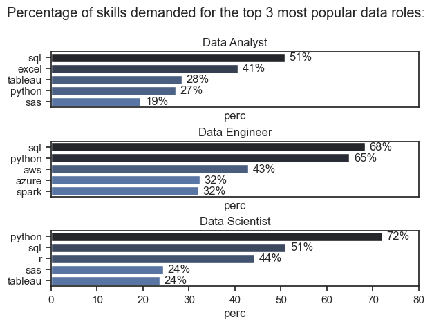
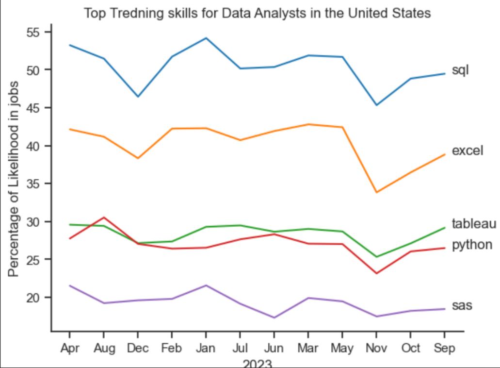

# Overview:
   Welcome to my analysis of the data job market, focusing on data analyst roles. This project was created out of a desire to navigate and understand the job market more effectively. It delves into the top-paying and in-demand skills to help find optimal job opportunities for data analysts.

The dataset was taken from HuggingFace which provides a foundation for my analysis, containing detailed information on job titles, salaries, locations, and essential skills. Through a series of Python scripts, I explore key questions such as the most demanded skills, salary trends, and the intersection of demand and salary in data analytics.

## The Questions:
Below are the questions I want to answer in my project:

#### 1. What are the skills most in demand for the top 3 most popular data roles?
#### 2. How are in-demand skills trending for Data Analysts?
#### 3. How well do jobs and skills pay for Data Analysts?
#### 4. What are the optimal skills for data analysts to learn? (High Demand AND High Paying)
## Tools used:
For my deep dive into the data analyst job market, I harnessed the power of several key tools:

#### Python:
 The backbone of my analysis, allowing me to analyze the data and find critical insights.I also used the following Python libraries:

#### Pandas Library:
This was used to analyze the data.

#### Matplotlib Library: 
I visualized the data.

#### Seaborn Library: 
Helped me create more advanced visuals.

#### Jupyter Notebooks: 
The tool I used to run my Python scripts which let me easily include my notes and analysis.

#### Visual Studio Code:
 My go-to for executing my Python scripts.

#### Git & GitHub: 
Essential for version control and sharing my Python code and analysis, ensuring collaboration and project tracking.
Data Preparation and Cleanup
This section outlines the steps taken to prepare the data for analysis, ensuring accuracy and usability.

## Import & Clean Up Data:
I start by importing necessary libraries and loading the dataset, followed by initial data cleaning tasks to ensure data quality.

## Importing Libraries
import ast
import pandas as pd
import seaborn as sns
from datasets import load_dataset
import matplotlib.pyplot as plt  

## Loading Data
dataset = load_dataset('lukebarousse/data_jobs')
df = dataset['train'].to_pandas()

## Data Cleanup
``` df['job_posted_date'] = pd.to_datetime(df['job_posted_date'])
df['job_skills'] = df['job_skills'].apply(lambda x: ast.literal_eval(x) if pd.notna(x) else x)
 ```

 ## 📊 Report: What Are the Demanded Skills for the Top 3 Most Popular Data Roles in the United States?
## Overview
This report explores the top technical skills most in demand for three major data career paths:

### Data Analyst

### Data Engineer

### Data Scientist

The goal is to help understand which skills are most valuable in the job market for each role, based on job posting data.

#### 2. Approach & Code Used:

The chart was likely generated using Python’s pandas, seaborn, and matplotlib libraries. The data was organized by role, with associated skills and their demand percentages. A horizontal bar chart was then used to visualize the top 5 skills for each role side by side.

This type of visualization makes it easier to compare which tools and technologies dominate each job role.
```
fig,ax=plt.subplots(len(job_list), 1)
sns.set_theme(style='ticks')
for i, j_title in enumerate(job_list):
    plott=df_percent[df_percent['job_title_short']==j_title].head(5)
    sns.barplot(data=plott, x='perc', y='job_skills',ax=ax[i], hue='skills_count', palette='dark:b_r')
    ax[i].set_title(j_title)
    ax[i].set_ylabel('')
    ax[i].set_xlim(0,80)
    ax[i].legend().set_visible(False)
    
    for index, value in enumerate(plott['perc']):
        ax[i].text(value+1, index,f'{value:.0f}%', va='center')

    if i !=len(job_list)-1:     
     ax[i].set_xticks([])
fig.suptitle("Percentage of skills demanded for the top 3 most popular data roles:")
fig.tight_layout(h_pad=0.5)
plt.show()
```

#### 3. Results Summary



Data Analysts rely most on SQL, Excel, and Tableau. These roles focus heavily on reporting, dashboarding, and querying structured data.

Data Engineers need strong SQL and Python skills, along with experience in cloud platforms like AWS and Azure. They’re expected to build data pipelines and work with big data tools like Spark.

Data Scientists are driven by Python proficiency, followed by SQL and R. These roles demand expertise in statistics, machine learning, and data modeling, with some visualization skills.

#### 4. Key Insights
SQL is the most universally required skill, appearing in all three roles.

 Python is essential for technical roles like Data Scientist and Data Engineer.

Analysts focus more on business tools (Excel, Tableau), while Engineers focus on cloud and backend systems.

Data Scientists have the most programming-heavy role, blending coding with analytics and machine learning.

## 📊 Report:  How are in-demand skills trending for Data Analysts? 

## Overview
This report presents the trending skills most frequently required in job listings for data analysts in the United States from April 2023 to September 2023. The focus is on five key tools and programming languages: SQL, Excel, Tableau, Python, and SAS.

## Approach and Code:

To generate the line chart, historical job posting data was collected from job portals like LinkedIn or Indeed, quantifying the percentage of listings mentioning each skill over time. The data was visualized using Python libraries such as Matplotlib or Seaborn. A hypothetical example of the code used is below:
```
df_plot=df_pivot_percentage.iloc[: , :5]
sns.set_theme(style='ticks')
sns.lineplot(data=df_plot, dashes=False, palette="tab10")
plt.title("Top Tredning skills for Data Analysts in the United States")
plt.xlabel("2023")
plt.ylabel("Percentage of Likelihood in jobs")
plt.legend().remove()
sns.despine()
for i in range(5):
    plt.text(11.2, df_plot.iloc[-1,i], df_plot.columns[i])
```

## Result


-SQL consistently ranks the highest, with over 45–54% of job postings requiring it.

-Excel is the second most demanded skill, although it experiences a noticeable dip in late 2023.

-Tableau and Python remain mid-tier, with usage fluctuating around 27–30%.

-SAS has the lowest demand, staying below 22%.

## Insights

-SQL remains the most essential skill, reinforcing its status as a fundamental tool in data analytics roles.

-Excel’s dip around October-November 2023 may indicate a shift towards more automated or advanced reporting tools during that period.

-Python and Tableau are close competitors, highlighting that data visualization and programming both play a strong role in analytics.

-SAS's steady decline may reflect its replacement by more open-source tools like Python and R in most industries.